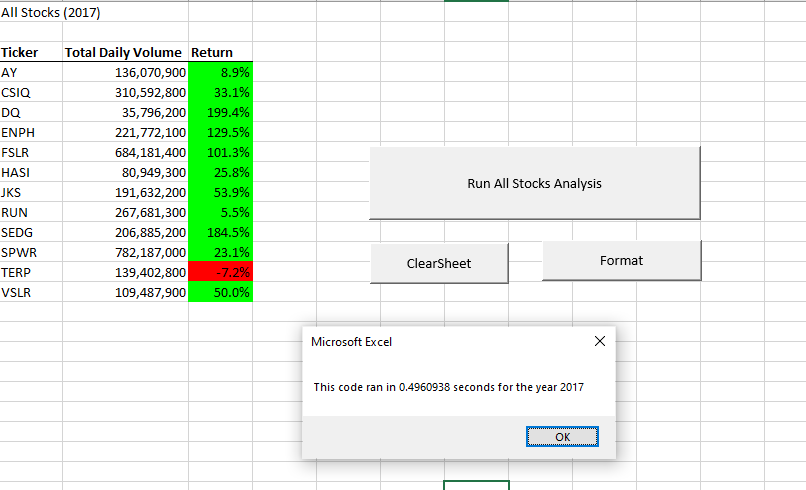
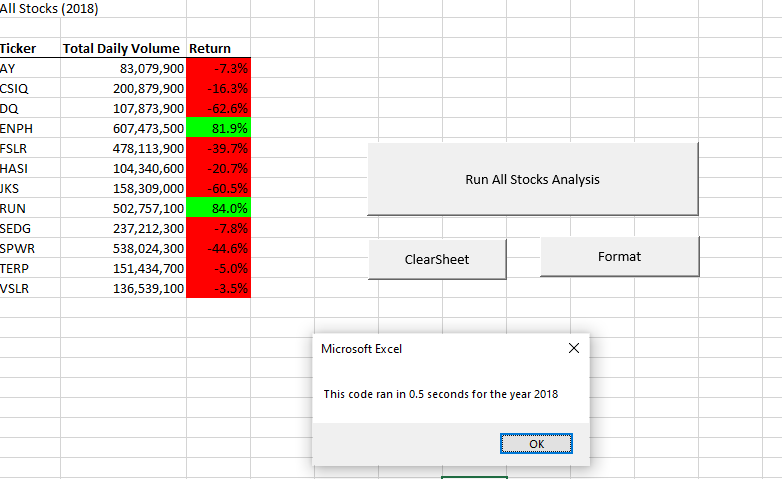
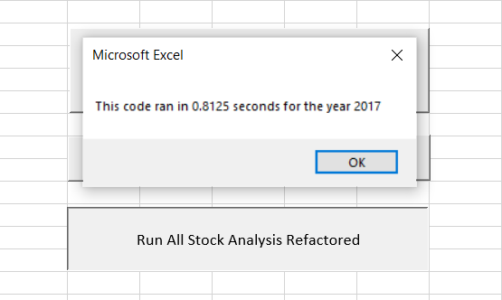
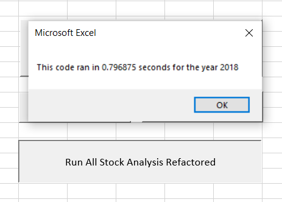

***Stocks Analysis with VBA and Excel***

***Overview of Project***

**Purpose**

The purpose of this analysis is helping individuals, who are passionate about
green energy, gain an edge in the green energy stock market. The analysis aims
to provide valuable data-backed insights that would help them make informed
investment decisions. In general, technical stocks analysis attempts to predict
the future activity of stocks by looking at their price history and evaluate
recent trading movements and trends.

Per a customer request, the analysis first looked into *Daqo New Energy
Corporation’s* stocks. *Daqo* is a Chinese company engaged in the manufacture of
monocrystalline silicon and polysilicon, primarily for use in solar photovoltaic
systems. Total daily volume and yearly return were generated to understand how
this stock is being traded in daily bases and how it grew over a certain year
and how that get reflected on the value of the stock. However, to understand if
this certain stock is a good investing option in comparison to similar industry
stocks, another eleven green energy stocks were analyzed.

**Analysis and Challenges**

To achieve the purpose, green energy stock market dataset was analyzed in Excel
using VBA. Certain codes were used in VBA to automate the needed tasks in order
to minimize the chances of errors and reduces the time needed to run analyses,
especially with repeated tasks. Solution codes to loop through all the data and
collect an entire dataset were used.

**Results**:

The analysis shows that overall, 2017 (see img. 1) was overall a better year for
the green energy stocks market, compared to 2018 (see img. 2). For 2017 and 2018
\$TERP stock was underperforming compared to the rest of the industry. The most
successful stock for both years was \$ENPH and \$RUN.

**The Refactoring code**
```
Sub AllStocksAnalysisRefactored()
    Dim startTime As Single
    Dim endTime  As Single

    yearValue = InputBox("What year would you like to run the analysis on?")

    startTime = Timer
    
    'Format the output sheet on All Stocks Analysis worksheet
    Worksheets("All Stocks Analysis").Activate
    
    Range("A1").Value = "All Stocks (" + yearValue + ")"
    
    'Create a header row
    Cells(3, 1).Value = "Ticker"
    Cells(3, 2).Value = "Total Daily Volume"
    Cells(3, 3).Value = "Return"

    'Initialize array of all tickers
    Dim tickers(12) As String
    
    tickers(0) = "AY"
    tickers(1) = "CSIQ"
    tickers(2) = "DQ"
    tickers(3) = "ENPH"
    tickers(4) = "FSLR"
    tickers(5) = "HASI"
    tickers(6) = "JKS"
    tickers(7) = "RUN"
    tickers(8) = "SEDG"
    tickers(9) = "SPWR"
    tickers(10) = "TERP"
    tickers(11) = "VSLR"
    
    'Activate data worksheet
    Worksheets(yearValue).Activate
    
    'Get the number of rows to loop over
    RowCount = Cells(Rows.Count, "A").End(xlUp).Row
    
    '1a) Create a ticker Index
   For i = 0 To 11
       tickerIndex = tickers(i)
       
       
    '1b) Create three output arrays
    Dim tickerVolumes As Long
    Dim tickerStartingPrices As Single
    Dim tickerEndingPrices As Single
       
       
    ''2a) Create a for loop to initialize the tickerVolumes to zero.
    
       Worksheets(yearValue).Activate
       tickerVolumes = 0
       
    ''2b) Loop over all the rows in the spreadsheet.
    For j = 2 To RowCount
              
        If Cells(j, 1).Value = tickerIndex Then
           
        '3a) Increase volume for current ticker
              
            tickerVolumes = tickerVolumes + Cells(j, 8).Value
        
        End If
           
           
        '3b) Check if the current row is the first row with the selected tickerIndex.
        'If  Then
        
            If Cells(j - 1, 1).Value <> tickerIndex And Cells(j, 1).Value = tickerIndex Then

               tickerStartingPrices = Cells(j, 6).Value
               
          'End If
           End If

        '3c) check if the current row is the last row with the selected ticker
         'If the next row’s ticker doesn’t match, increase the tickerIndex.
        
           If Cells(j + 1, 1).Value <> tickerIndex And Cells(j, 1).Value = tickerIndex Then

               tickerEndingPrices = Cells(j, 6).Value
               
          'End If
           End If
           
       Next j
       
    '4) Loop through your arrays to output the Ticker, Total Daily Volume, and Return.
    For k = 0 To 11
           Worksheets("All Stocks Analysis").Activate
           
           Cells(4 + i, 1).Value = tickerIndex
           Cells(4 + i, 2).Value = tickerVolumes
           Cells(4 + i, 3).Value = tickerEndingPrices / tickerStartingPrices - 1
            
         Next k

   Next i
 
   
    'Formatting
    Worksheets("All Stocks Analysis").Activate
    
    Range("A3:C3").Font.FontStyle = "Bold"
    Range("A3:C3").Borders(xlEdgeBottom).LineStyle = xlContinuous
    Range("B4:B15").NumberFormat = "#,##0"
    Range("C4:C15").NumberFormat = "0.0%"
    Columns("B").AutoFit
    
    dataRowStart = 4
    dataRowEnd = 15
    
    For g = dataRowStart To dataRowEnd

        If Cells(g, 3) > 0 Then

            'Color the cell green
            Cells(g, 3).Interior.Color = vbGreen

        ElseIf Cells(g, 3) < 0 Then

            'Color the cell red
            Cells(g, 3).Interior.Color = vbRed

        Else

            'Clear the cell color
            Cells(g, 3).Interior.Color = xlNone

        End If

    Next g
    
 
    endTime = Timer
    MsgBox "This code ran in " & (endTime - startTime) & " seconds for the year " & (yearValue)

End Sub

```



(img. 1)



(img. 2)

Note: Refactoring the code reduced the running time of the processes, see (Img.
3) and (img. 4)



(img. 3)



(img. 4)


**Summary**

In general, refactoring is a much-needed activity in case we wanted to
contribute to the opensource community or create our own libraries of codes and
micro programs that we can reuse or someone else in the future.

The main disadvantage of refactoring the code was the time spent on rewriting it
and debugging which consumed more time the writing the original code.

On the other hand, the main advantages of refactoring the code, it made the used
VBA script run faster but it also made reusing the code in the future an easy
task, as it’s much easier to read and understand. Refactoring was achieved by
improving the logics of the code making the code more efficient as it uses fewer
steps and less memory.
